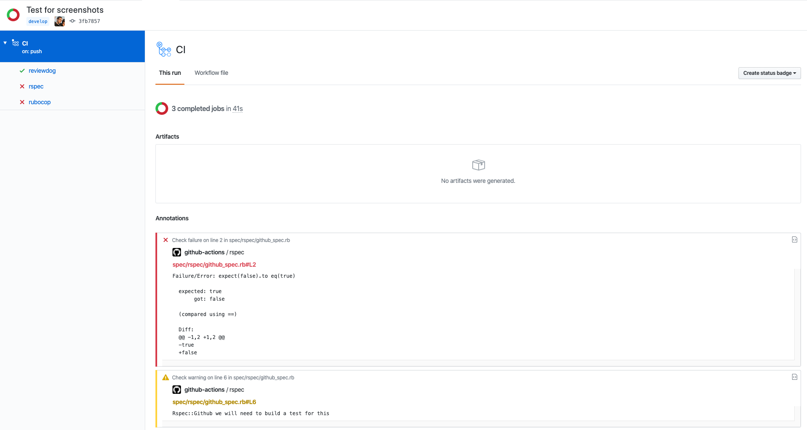

# Rspec::Github
[](https://github.com/Drieam/rspec-github/actions/workflows/ci.yml)
[](https://badge.fury.io/rb/rspec-github)

[RSpec](https://rspec.info/) formatter compatible with [GitHub Action](https://github.com/features/actions)'s annotations. It supports multiline errors and will set pending specs as warnings:



## Installation
Add the gem to your application's `Gemfile` `test` group:

```ruby
group :test do
  gem 'rspec-github', require: false
end
```

And then of course install the gem by executing:

```bash
bundle install
```

## Usage
You can specify the formatter with a command line argument:

```bash
rspec --format RSpec::Github::Formatter
```

And to always run it with this formatter, you can set it in the `.rspec` file:

```
# other configuration
--format RSpec::Github::Formatter
```

And to register the formatter in configuration, you can add the following to `spec/spec_helper.rb`:

```ruby
RSpec.configure do |config|
  # Use the GitHub Annotations formatter for CI
  if ENV['GITHUB_ACTIONS'] == 'true'
    require 'rspec/github'
    config.add_formatter RSpec::Github::Formatter
  end
end
```

Note that you can select multiple formatters so that you can also see other output:
```bash
rspec --format RSpec::Github::Formatter --format progress
rspec --format RSpec::Github::Formatter --format documentation
```

If you want to disable annotations for pending specs you can do that by adding `--tag ~skip` to your command:
```bash
rspec --format RSpec::Github::Formatter --tag ~skip
```

## Development
After checking out the repo, run `bundle install` to install dependencies. Then, run `rake spec` to run the tests.
Publishing a new version is handled by the [publish workflow](.github/workflows/publish.yml). This workflow publishes a GitHub release to [rubygems](https://rubygems.org/) with the version defined in the release.

### Useful references
- https://help.github.com/en/actions/reference/development-tools-for-github-actions
- https://developer.github.com/apps/quickstart-guides/creating-ci-tests-with-the-checks-api

## License
The gem is available as open source under the terms of the [MIT License](https://opensource.org/licenses/MIT).
